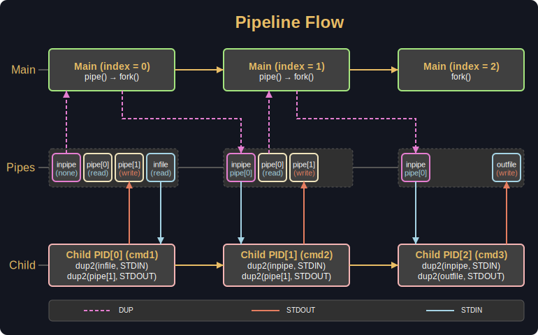

<h1 align="center">
  
</h1>

<p align="center">
  <b><i>Pipeline unix 🐧 commands with redirect operators.</i></b><br>
</p>

<p align="center">
  
  
	
  
</p>

<p align="center">
  
  
</p>

<div align="center">

## Table of Contents
[📝 General](#-general)
[🛠️ Build](#️-build)
[⚡ Usage](#-usage)
[🚀 Details](#-details)
[♻️ Resources](#️-resources)

</div>

## 📝 General

Goal of the project is to run multiple `unix` commands with `execve` by creating child processes with `fork` and communicating between them using `pipe`.

It also features `redirections` to file descriptors using `dup` and `dup2`.

Project `passes` many of the 42 `testers`, including [franzinette](https://github.com/xicodomingues/francinette) `strict`.

⚠️ For studies perspective I `highly` recommend that you finish the `bonus` part of this project. ⚠️

## 🛠️ Build

GNU `make` and `gcc` are required to build and compile the project.

```bash
git clone --recurse-submodules https://github.com/Jarnomer/pipex.git
```

```bash
cd pipex && make all
```

## ⚡ Usage

Pipex needs an `infile` to open, at least `two` unix `commands` and `outfile` to `truncate` the result:

```bash
./pipex Makefile cat 'wc -l' outfile
```

Will be the same as `bash` syntax:

```bash
< Makefile cat | wc -l > outfile
```

Additionally `heredoc` with `EOF` and `multiple` unix commands are supported.

When heredoc is used, result is `appended` to outfile.

```bash
./pipex here_doc EOF cat cat 'wc -l' outfile
```

Will be the same as bash syntax:

```bash
<< EOF cat | cat | wc -l >> outfile
```

## 🚀 Details

Main is responsible for creating `child processes` in while loop.

```c
void child_process(t_pipex *ppx)
{
  if (ppx->index != ppx->cmd_count && pipe(ppx->pipe) == -1)
    error_occured(ERR_PIPE, MSG_PIPE, ppx);
  ppx->pids[ppx->index] = fork();
  if (ppx->pids[ppx->index] == -1)
    error_occured(ERR_FORK, MSG_FORK, ppx);
  else if (ppx->pids[ppx->index] != 0)
    prep_next_pipe(ppx);
  else if (ppx->pids[ppx->index] == 0)
  {
    redirect_fds(ppx);
    close_all_fds(ppx);
    execute_cmd(ppx);
  }
}
```

Main process will upkeep the `pipeline` while child will `execute` the command.



```c
static void prep_next_pipe(t_pipex *ppx)
{
  close(ppx->pipe[WR_END]);
  if (ppx->inpipe != -1)
    close(ppx->inpipe);
  ppx->inpipe = dup(ppx->pipe[RD_END]);
  close(ppx->pipe[RD_END]);
}
```

```c
static void execute_cmd(t_pipex *ppx)
{
  parse_command(ppx->argv[ppx->start_pos + ppx->index], ppx);
  ppx->exec = executable_path(ppx);
  if (!ppx->cmd || !*ppx->cmd || !ppx->exec
    || execve(ppx->exec, ppx->cmd, ppx->envp) == -1)
    error_occured(ERR_CMD, MSG_CMD, ppx);
}
```

The command goes throught custom parser to handle `quotes` and `backslashes`.

```c
void parse_command(char *cmd, t_pipex *ppx)
{
  t_parse parser;
  int     count;
  int     i;

  ft_bzero(&parser, sizeof(t_parse));
  count = count_tokens(cmd, &parser);
  ppx->cmd = ft_calloc(count + 1, sizeof(char *));
  if (!ppx->cmd)
    error_occured(ERR_MEM, MSG_MEM, ppx);
  i = 0;
  while (i < count)
  {
    ppx->cmd[i] = extract_token(&cmd, &parser);
    if (!ppx->cmd[i])
      error_occured(ERR_MEM, MSG_MEM, ppx);
    i++;
  }
}
```

## ♻️ Resources

[franzinette](https://github.com/xicodomingues/francinette) amazing unit test framework for `pipex` and other 42 projects.

[pipex-tester](https://github.com/vfurmane/pipex-tester) effective basic tester that is inline with the subject.

[pipex_tester](https://github.com/bastienkody/pipex_tester) more complex and extensive tests like commands with quotes.

[pipex-error-tester](https://github.com/Jarnomer/pipex-error-tester) my personal tester focusing on error handling but includes other tests as well.

## 4️⃣2️⃣ Footer

For my other 42 projects and general information, please refer the [Hive42](https://github.com/Jarnomer/Hive42) page.

I have also created error handling [unit testers](https://github.com/Jarnomer/42Testers) for `pipex`, `so_long` and `cub3D`.

### Cheers and good luck! 🥳